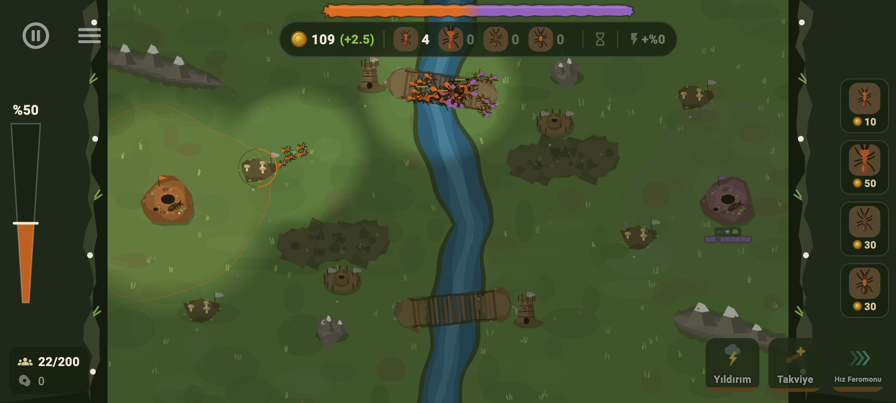
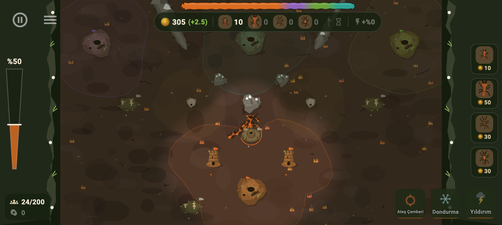
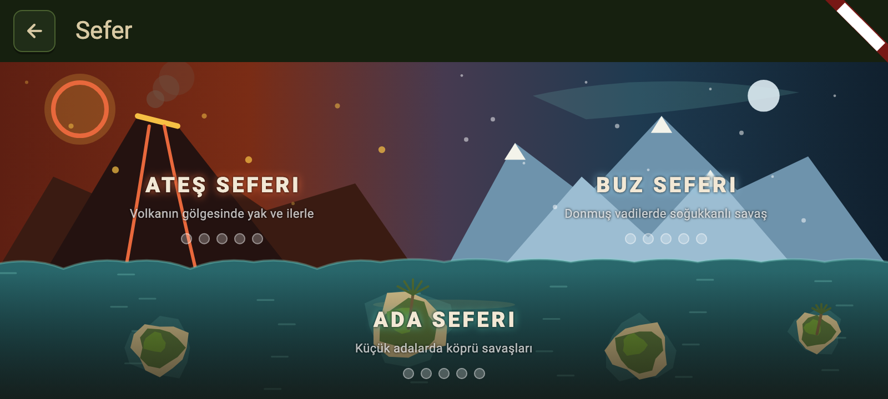
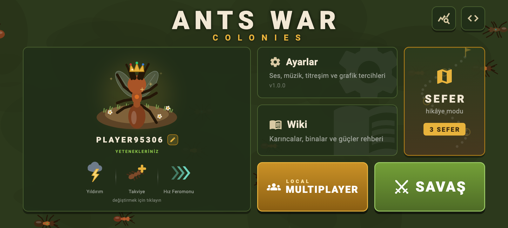
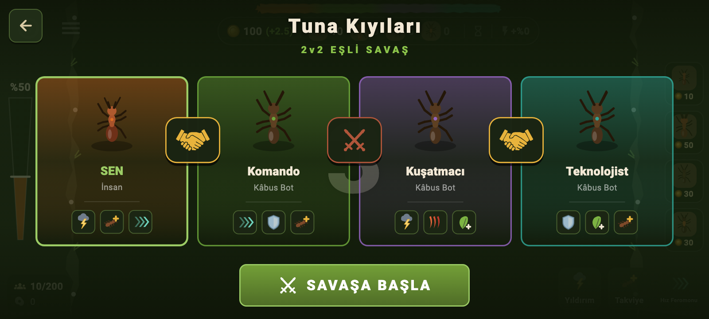
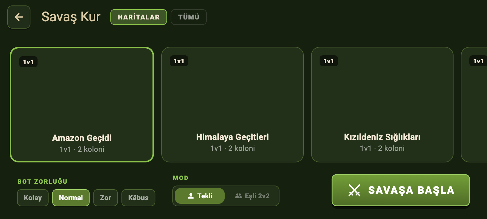
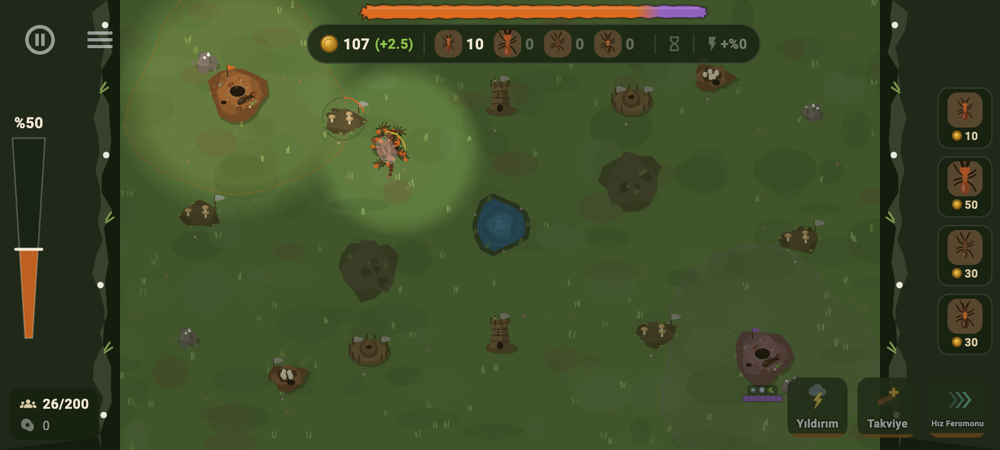

# Ants War: Colonies 🐜⚔️

**Karınca kolonisi temalı gerçek zamanlı strateji (RTS) oyunu.**

<p align="center">
  
</p>
<p align="center">
  
  
  
</p>
<p align="center">
  
  
  
</p>

Tek ekranlık bir haritada karınca kolonini yönetirsin: ana yuvandan asker
üretir, sürükle-bırak ile sahaya sürer, haritadaki nötr binaları çevresinde
çoğunluk kurarak ele geçirir ve rakip **kraliçeyi** öldürmeye çalışırsın.
Kraliçesi ölen koloni elenir; son kalan taraf kazanır.

Flutter + Flame ile yazıldı. Tüm grafikler **prosedürel** çizilir (tek bir
harici sprite yok), tüm metinler **Türkçe**dir. Birincil platform **Android**
(yatay mod); web ve masaüstünde de çalışır.

## Öne Çıkanlar

- 🐜 **4 asker tipi**, taş-kağıt-makas counter zinciriyle: sürücü ateş
  karıncası, menzilli orman karıncası, suikastçı kapan çene, tank kesici.
- ⚡ **11 kraliçe yeteneği** (yıldırım, dondurma, ateş çemberi, korku
  çığlığı…) — maç başında 3 slot seçersin, botlar da kendi setini kuşanır.
- 🗺️ **11 harita, 3 arazi teması** (çimen / çorak-lav / kar-buz) ve canlı
  **harita öğeleri**: yavaşlatan bataklıklar, periyodik açılan gelgit
  geçitleri, kazılıp kalıcı açılan kaya tıkaçları, nötr yaban arısı
  yuvaları, ikinci çıkış veren kuluçka istasyonları.
- 🏰 **SEFER modu:** 3 kampanya (Ateş 🔥 / Buz ❄️ / Ada 🏝️) × 5 görev;
  brifing sayfaları, 2v1-3v1 kıskaçlar, kalıcı ilerleme.
- 🤝 **Eşli 2v2**, 3 zorlukta stratejik botlar (toplanma, çift kanat
  taarruzu, ikinci dalga) ve adım adım **yaptırarak öğreten eğitim**.
- 📶 **LAN Multiplayer:** sunucusuz, aynı Wi-Fi'da otomatik keşif —
  oyun kur ya da "X'in oyunu"na dokunup katıl; 1v1 / 1v1v1 / 1v1v1v1 /
  2v2 eşli formatlar, boş slotlar botla dolar.
- 🌫️ Adil **savaş sisi** (harita hep görünür, yalnız canlı bilgi gizli),
  organik bölge sınırları, güç dağılım barı, rastgele rotasyonlu müzik.
- 🌍 **Türkçe + English:** dil ayarlardan anında değiştirilir — tüm
  arayüz, yetenekler, wiki ve sefer brifingleri iki dillidir.

Kuralların, birimlerin, yeteneklerin ve tüm modların ayrıntısı:
**[docs/GAMEPLAY.md](docs/GAMEPLAY.md)**

## Çalıştırma

```bash
flutter pub get
flutter run                 # bağlı Android cihaz/emülatör
flutter test                # tüm testler
flutter build apk --release # Android paketi
flutter build web --release --base-href "/oyun-yolu/"  # web sürümü
```

macOS'ta geliştirme için eski Xcode uyumu adına `audioplayers_darwin` yerel
bir Dart stub'ıyla override edilmiştir (ses macOS/iOS'ta sessiz, Android ve
web'de tam). Xcode 15+ kuruluysa `pubspec.yaml`daki `dependency_overrides`
bloğu kaldırılabilir.

## Proje Yapısı

```
lib/
  data/      # oyun verileri: haritalar, birimler, yetenekler, seferler, sabitler
  models/    # saf oyun modelleri: bina, yuva, oyuncu, harita tanımı
  game/      # Flame tarafı: oyun döngüsü, birimler, botlar, harita çizimi, ses
  ui/        # Flutter ekranları: menü, HUD, sefer, wiki, ayarlar, eğitim
assets/      # ikon, harita kartı görselleri, müzik ve ses efektleri
test/        # birim + widget + golden testleri (goldenlar varlık hattıdır)
docs/        # oyun rehberi, teknik belge, tanıtım görselleri
tool/        # yardımcı betikler (harita kartı görsellerini güncelleme vb.)
```

Grafiklerin tamamı kodla çizildiği için "asset pipeline" da testlerdir:
harita kartları ve uygulama ikonu, golden testlerin ürettiği gerçek oyun
görüntülerinden üretilir.

## Belgeler

- **[docs/GAMEPLAY.md](docs/GAMEPLAY.md)** — tüm oyun kuralları, birim/bina
  tabloları, yetenekler, haritalar ve sefer detayları.
- **[docs/TECHNICAL.md](docs/TECHNICAL.md)** — mimari, sistemler, tema
  renkleri, tasarım dili ve yeni harita/yetenek ekleme rehberleri. Projeye
  katkı vermeden önce okuyun; her yeni içerik oradaki konsepte uymalı.
- **[CREDITS.md](CREDITS.md)** — ses varlıklarının lisans ve atıfları.
